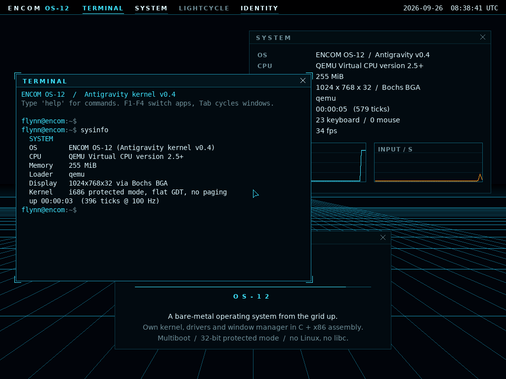

# ENCOM OS-12 — Antigravity kernel

Bare-metal hobby operating system in C and x86 assembly, styled after the ENCOM operating systems of the TRON universe. Own kernel, own drivers, own window manager — no Linux, no libc.



## What it does

- **Boots** via Multiboot (QEMU `-kernel`) or a GRUB ISO (real PC via USB stick, UTM, VirtualBox)
- **Graphics**: 1024×768×32 linear framebuffer — from GRUB/VBE, or programmed directly through the Bochs/VirtualBox graphics adapter (BGA). Falls back to the VGA text shell if neither exists
- **Desktop**: animated TRON grid, top bar with apps and RTC clock, draggable windows with ENCOM corner brackets, mouse cursor, anti-aliased fonts
- **Apps**: `TERMINAL` (shell), `SYSTEM` (CPU, memory, display, IRQ counters, live FPS/input graphs), `LIGHTCYCLE` (you vs. a program), `IDENTITY`
- **Panic screen**: any CPU exception ends in a `DEREZZED` screen with the full register dump instead of a silent triple fault

Controls: **F1–F4** switch apps, **Tab** cycles windows, mouse drags windows by the title bar, click a bar entry to focus/close.

## Build & run

```bash
sudo apt install nasm gcc-multilib qemu-system-x86 grub-pc-bin xorriso mtools
make            # kernel.bin
make run        # QEMU window (serial log on stdout)
make iso        # encom-os.iso — bootable on real hardware (BIOS/CSM) and in VMs
make run-iso
make test       # headless smoke test (also: make test-iso)
```

The ISO is also built by CI on every push: **Actions → latest run → Artifacts → encom-os-iso**.

## Shell

`help` · `clear` · `sysinfo` · `uptime` · `date` · `echo <text>` · `open terminal|system|lightcycle|identity` · `about` · `derez` · `reboot` · `halt`

## Architecture

```
boot.asm      Multiboot header (asks the loader for 1024x768x32), stack, -> kernel_main(magic, mbi)
kernel.c      GDT -> IDT -> PIC -> PIT/keyboard/mouse -> framebuffer? desktop : text shell
gdt.c         flat 4 GiB code/data segments
idt.c         exceptions 0-31 -> panic.c, IRQ0 timer, IRQ1 keyboard, IRQ12 mouse
fb.c          framebuffer discovery (Multiboot / BGA via PCI), back buffer, clipped 2D primitives
font.c        anti-aliased glyph blitter; font_data.c generated by tools/mkfont.py (DejaVu)
gui.c         boot sequence, window manager, desktop, apps
shell.c       command interpreter shared by GUI terminal and VGA text console
timer.c rtc.c mouse.c keyboard.c serial.c pci.c   drivers
```

Everything is redrawn into a back buffer each frame (~33 fps) and copied to VRAM — simple, and fast enough at 1024×768.

## Test

`tools/smoketest.py` boots the image in QEMU, types commands through the QEMU monitor and checks the serial log (the shell mirrors to COM1) plus a screendump of the desktop: framebuffer found, desktop drawn at 1024×768, shell commands incl. Shift, apps open, CPU exception → `DEREZZED` without a triple fault.

## Credits

Glyphs rendered from DejaVu Sans / Sans Mono (Bitstream Vera License). TRON and ENCOM are trademarks of Disney; this is a non-commercial fan project.
